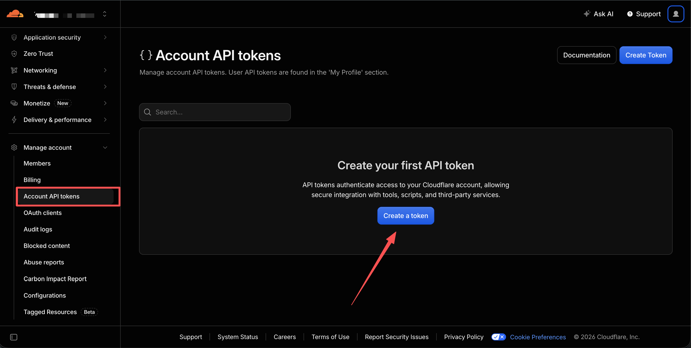
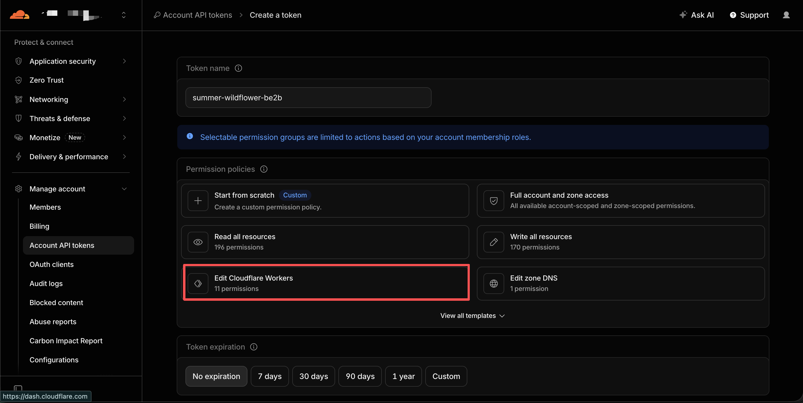
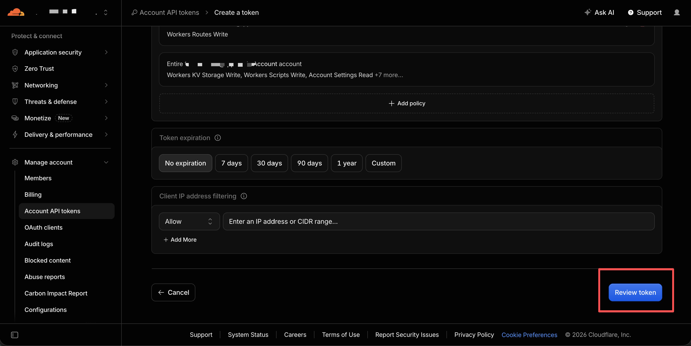
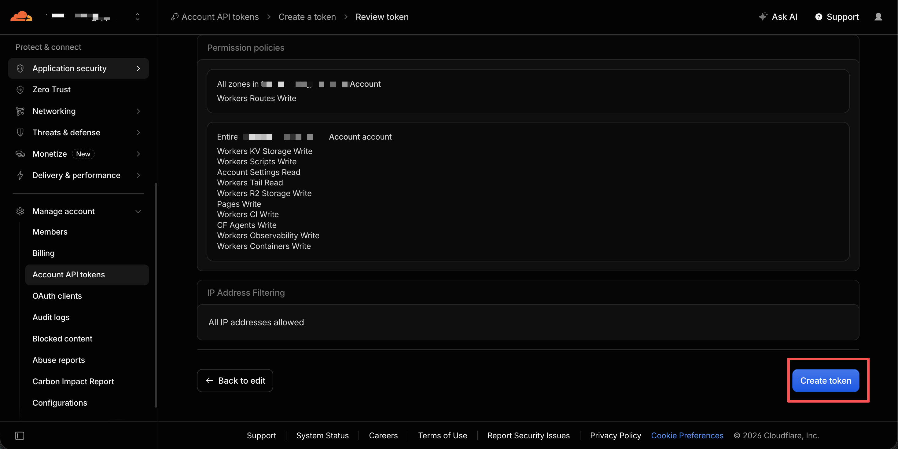
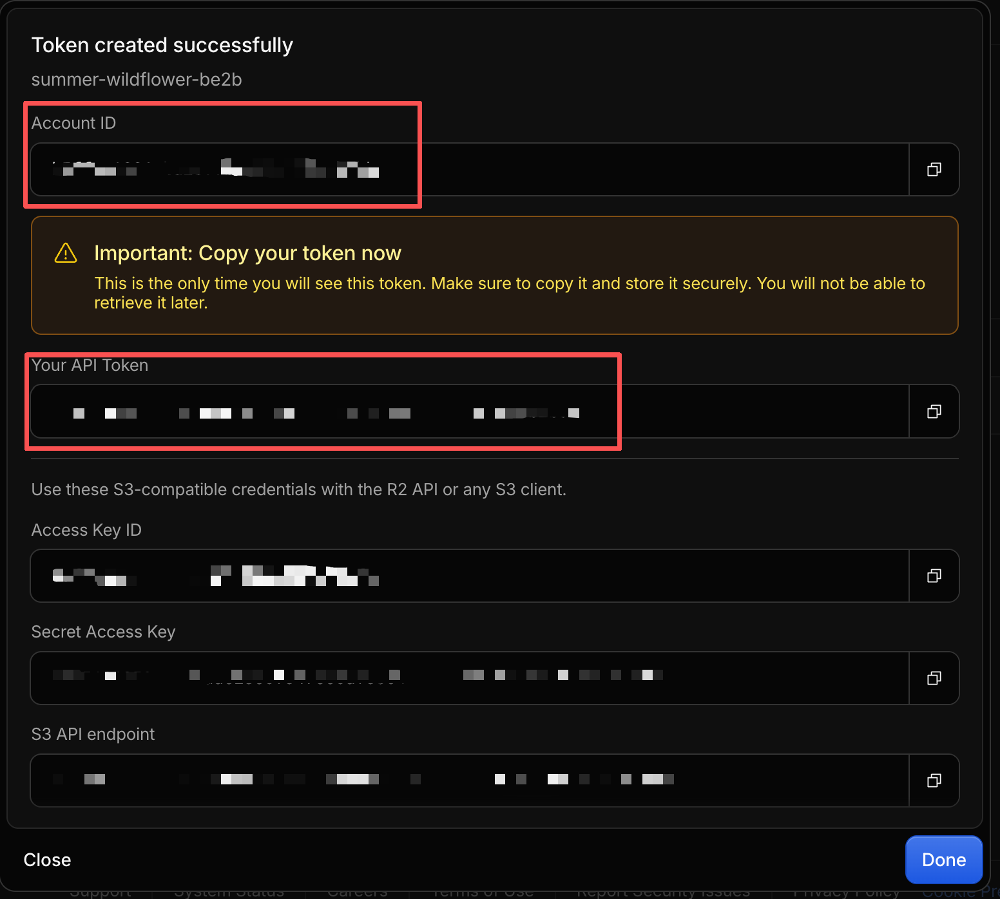
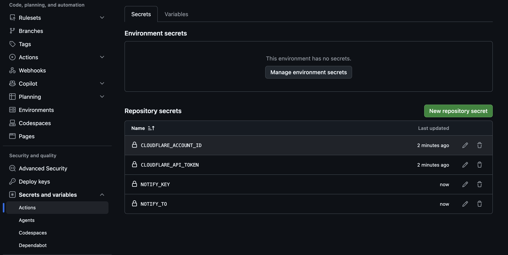
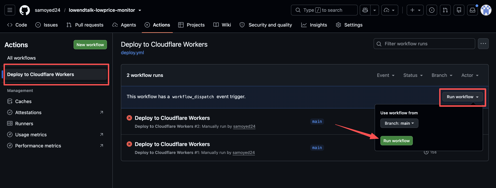
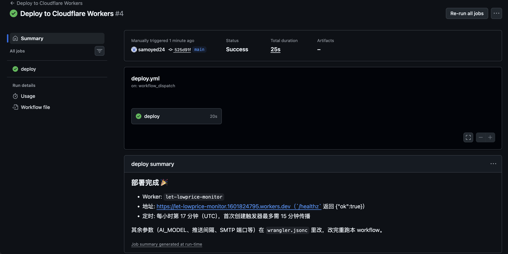
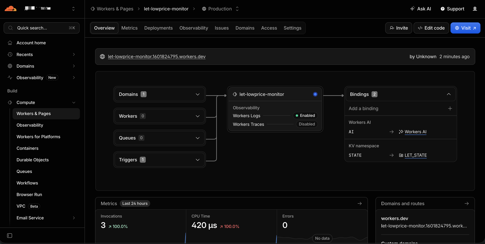

# lowendtalk-lowprice-monitor

定时抓取 [LowEndTalk](https://lowendtalk.com) 的 Offers 板块，用 Workers AI 打标签并生成中文摘要，去重后把新增条目邮件推送。

跑在 **Cloudflare Worker Cron** 上：定时唤醒 → 抓取 → AI 打标 → 去重 → 发信。状态存在 KV，AI 走 Workers AI 绑定，发信走 AgentNotify（推荐）或自定义 SMTP。

---

## 目录

- [一、一键部署（GitHub Actions）](#一一键部署github-actions)
- [二、为什么推荐用 AgentNotify，而不是自建 SMTP](#二为什么推荐用-agentnotify而不是自建-smtp)
- [三、部署后调整参数](#三部署后调整参数)
- [四、配置项](#四配置项)
- [五、推送间隔](#五推送间隔)
- [六、工作方式](#六工作方式)
- [七、本地开发与部署](#七本地开发与部署)
- [八、常见问题](#八常见问题)
- [九、已知限制](#九已知限制)

---

## 一、一键部署（GitHub Actions）

不用装 Node、不用配 wrangler，全程在 GitHub 网页上完成。**只需填入部署必需参数，其余用仓库默认值**（见[第三节](#三部署后调整参数)）。

### 1. Fork 本仓库

点右上角 **Fork**，fork 到你自己的账号。

### 2. 创建 Cloudflare API Token

打开 [Cloudflare Dashboard → API Tokens](https://dash.cloudflare.com/profile/api-tokens) → **Create Token**。



选择官方模板 **Edit Cloudflare Workers**（含 Workers Scripts 与 Workers KV 的编辑权限），或自定义勾选：

- `Workers Scripts: Edit`
- `Workers KV Storage: Edit`





创建并确认。



**Token 只显示一次，务必当场复制**。



> 同一页面下方的 `Access Key ID` / `Secret Access Key` 是 R2 的 S3 凭证，**本项目用不到**，不要填进 GitHub Secrets。

### 3. 找到 Account ID

在 [Cloudflare Dashboard](https://dash.cloudflare.com) 打开 **Workers & Pages**，右侧 **Account ID** 即为所需值；也可在账号首页 URL 里找到。

### 4. 在 fork 的仓库里填 Secrets

**Settings → Secrets and variables → Actions → New repository secret**。



必填（两个）：

| 名称 | 说明 |
|---|---|
| `CLOUDFLARE_API_TOKEN` | 上一步创建的 API Token |
| `CLOUDFLARE_ACCOUNT_ID` | 你的 Cloudflare Account ID |

推送通道（**至少配一个**，推荐通道 1，理由见[第二节](#二为什么推荐用-agentnotify而不是自建-smtp)）：

| 名称 | 必填 | 说明 |
|---|---|---|
| `NOTIFY_KEY` | 通道 1 | AgentNotify API Key，形如 `pck_xxx` |
| `NOTIFY_TO` | 通道 1 | 收件邮箱（须与控制台验证过的地址一致） |
| `SMTP_USER` | 通道 2 | 发件邮箱，如 `you@qq.com` |
| `SMTP_PASS` | 通道 2 | 邮箱授权码（不是登录密码） |
| `MAIL_TO` | 通道 2 | 收件邮箱 |

### 5. 运行 workflow

**Actions → Deploy to Cloudflare Workers → Run workflow**（分支选 `main`）→ 绿色 **Run workflow**。



workflow 会自动：

1. 校验必填 Secrets；
2. 跑一遍测试；
3. 查找账号里名为 `LET_STATE` 的 KV namespace，没有就创建，并把 id 写进 `wrangler.jsonc`；
4. 部署 Worker（首次即包含 `0 * * * *` 定时触发器）；
5. 把填写的推送参数写成 Worker secrets；
6. 在运行摘要里打印 Worker 地址。

**部署是手动触发的**：push 代码不会自动部署，避免 fork 后误跑。

运行成功后在 **deploy summary** 里能看到 Worker 地址：



### 6. 确认结果

- Actions 运行成功，摘要里能看到 Worker 地址（形如 `https://let-lowprice-monitor.<你的子域>.workers.dev`）。
- 浏览器打开该地址的 `/healthz`，返回 `{"ok":true}`。
- 触发器首次创建或修改[最多需要 15 分钟传播](https://developers.cloudflare.com/workers/configuration/cron-triggers/)；传播完成后才会在下一个整点运行。

在 dashboard 的 **Workers & Pages → 你的 Worker** 可以确认绑定与触发器状态：



---

## 二、为什么推荐用 AgentNotify，而不是自建 SMTP

**结论：优先用 `NOTIFY_KEY` + `NOTIFY_TO`（AgentNotify），别一上来就自己配 SMTP。**

| 对比项 | AgentNotify（推荐） | 自建 SMTP |
|---|---|---|
| 配置成本 | 填 2 个 Secret，登录控制台点几下 | 需要邮箱、授权码、端口、TLS 模式四项 |
| 发件通道 | 服务方托管，不用管发信域名 | 依赖你自己的邮箱服务商 |
| 端口限制 | 不受影响 | 25 端口被 Cloudflare 禁止出站，只能 465 / 587 |
| 协议实现 | 标准 HTTPS API | 本项目手写 `EHLO → AUTH LOGIN → DATA`，出问题排查面更大 |
| 换收件人 | 改 1 个 Secret | 改 Secret，且可能要重新授权 |
| 失败可见性 | 返回 `log_id`，可查投递结果 | 只能看 SMTP 应答码 |

关键差异在于：**SMTP 是这套流程里最容易出问题的一环**。它要自己处理 TLS 升级、认证、编码和应答码解析，任一环节不对就静默失败；而 AgentNotify 只是两个 HTTPS 请求。

只有这些情况才值得自建 SMTP：已经有一套稳定的发信服务、需要特定发件域名、或不想依赖第三方。

> AgentNotify 使用前需先给其 GitHub 仓库点一个 Star，否则调用返回 `403 STAR_REQUIRED`。在 [notify.portcloud.online](https://notify.portcloud.online) 用 GitHub 登录控制台，在**接收邮箱**里添加并验证地址，再在 **API Key** 里创建 Key（明文只展示一次）。

---

## 三、部署后调整参数

**一键部署只填必需参数**：Cloudflare 凭据 + 一个推送通道。下面这些都用仓库默认值，**部署成功后按需再改**：

| 参数 | 默认值 | 怎么改 |
|---|---|---|
| `AI_MODEL` | `@cf/qwen/qwen3-30b-a3b-fp8` | 改 `wrangler.jsonc` 里的 `vars`，提交后**重跑 workflow** |
| `FEED_URL` | LET Offers RSS | 同上 |
| `LOOKBACK_DAYS` / `MAX_POSTS` | `7` / `60` | 同上 |
| `CLASSIFY_BATCH_SIZE` | `1` | 同上 |
| `REQUIRE_SERVER_TAG` | `true` | 同上 |
| `INTERVAL_MINUTES` | `60` | 同上，且要同步改 cron（见[第五节](#五推送间隔)） |
| `SMTP_HOST` / `SMTP_PORT` | `smtp.qq.com` / `465` | 同上 |
| `NOTIFY_URL` / `NOTIFY_TIMEOUT` | 见下表 | 同上 |

改 `wrangler.jsonc` 里的 `vars` 是**非敏感配置**，可以提交到仓库；提交后回 **Actions → Run workflow** 重新部署即可生效。

> 推送用的密钥（`NOTIFY_KEY`、`SMTP_PASS` 等）是敏感值，**只放在 GitHub Secrets 里**，不要写进 `wrangler.jsonc`。想更换收件邮箱或 API Key，改 GitHub Secret 后重跑 workflow。
> 也可以在 Cloudflare dashboard 的 Worker 设置里直接改 vars 与 secrets，但那会和仓库里的 `wrangler.jsonc` 脱节；下次重跑 workflow 会以仓库配置为准。

---

## 四、配置项

### Secrets（GitHub Secrets → workflow 写入 Worker）

| Secret | 必填 | 说明 |
|---|---|---|
| `NOTIFY_KEY` | 通道 1 | AgentNotify API Key，形如 `pck_xxx`（兼容旧 `PC_KEY`） |
| `NOTIFY_TO` | 通道 1 | 收件邮箱（与控制台验证过的地址一致；兼容旧 `PC_TO`） |
| `SMTP_USER` | 通道 2 | 发件邮箱，如 `you@qq.com` |
| `SMTP_PASS` | 通道 2 | 邮箱授权码（不是登录密码） |
| `MAIL_TO` | 通道 2 | 收件邮箱 |

两个通道至少配一个，都配则同时发送。

### Vars（`wrangler.jsonc`，可选，都有默认值）

| Variable | 默认值 | 说明 |
|---|---|---|
| `AI_MODEL` | `@cf/qwen/qwen3-30b-a3b-fp8` | Workers AI 模型；默认 Qwen3 30B A3B，调用时追加 `/no_think`，并用 JSON Schema 约束分类输出结构 |
| `FEED_URL` | LET Offers 板块 RSS | 抓取源，Worker 直连读取 |
| `LOOKBACK_DAYS` | `7` | 只处理最近 N 天的帖子 |
| `MAX_POSTS` | `60` | 单次送进 AI 的条数上限 |
| `CLASSIFY_BATCH_SIZE` | `1` | 单次 AI 分类的条数；完整正文默认每次 1 帖，避免多篇长文挤占上下文。调大会减少调用次数，但更容易超出模型限制 |
| `REQUIRE_SERVER_TAG` | `true` | 只推送带服务器类型标签的条目 |
| `INTERVAL_MINUTES` | `60` | 推送间隔（分钟），与 cron 保持一致 |
| `NOTIFY_URL` | `https://notify.portcloud.online` | AgentNotify API 地址（兼容旧 `PC_URL`） |
| `NOTIFY_TIMEOUT` | `60` | AgentNotify 轮询投递结果的总预算（秒），须为正整数（兼容旧 `PC_TIMEOUT`） |
| `SMTP_HOST` | `smtp.qq.com` | 自定义 SMTP 服务器 |
| `SMTP_PORT` | `465` | 465（隐式 TLS）或 587（STARTTLS）；25 被 Cloudflare 禁止 |

> **异步两段式投递**（AgentNotify）：`POST /api/v1/send` 只受理（返回 `201` + `log_id`），程序在受理后等待 1 秒，再用 `GET /api/v1/send/{log_id}` 每隔 1 秒轮询，直到 `success` / `failed` / `rejected`。受理只请求一次、**不重试发送**（重试可能重复投递）；受理后的轮询预算由 `NOTIFY_TIMEOUT`（默认 60 秒）控制。短暂查询网络错误、HTTP 429 / 5xx 会在预算内继续查询。超时或无法确认状态时，报「投递结果未知」并且不保存状态，不代表邮件一定未送达；后续运行可能再次发送未记入状态的内容，产生重复邮件，可根据报错中的 `log_id` 在控制台核对。

### 可选 Repository Variable

| 名称 | 说明 |
|---|---|
| `LET_STATE_KV_ID` | 想**复用已有** KV namespace 时填写其 id；不填则 workflow 自动查找/创建 `LET_STATE`。从旧部署迁移、想保留去重状态时用它。 |

设置位置：**Settings → Secrets and variables → Actions → Variables → New repository variable**。

---

## 五、推送间隔

间隔由两处共同决定，改动时**同步改两处**：

1. `wrangler.jsonc` 的 `triggers.crons`（唤醒频率，UTC）
2. `wrangler.jsonc` 的 `INTERVAL_MINUTES`（最短间隔，分钟）

| 推送间隔 | `INTERVAL_MINUTES` | cron（UTC） |
|---|---|---|
| 30 分钟 | `30` | `*/30 * * * *` |
| 1 小时（默认） | `60` | `0 * * * *` |
| 4 小时 | `240` | `0 */4 * * *` |

> **为什么用整点 `0 * * * *`，而不是某个错开的分钟（如 `17`）？**
> 错开分钟没有实际收益——cron 只是唤醒频率，真正决定是否执行的是 `INTERVAL_MINUTES`。反而要注意：`lastRun` 记的是**定时触发时刻**，所以整点触发配 60 分钟间隔时每次都会执行；若记成「完成时刻」，一次运行耗时几十秒会让下一次差几秒不满 60 分钟而被跳过，实际变成每两小时一次（本项目已修正）。
> `INTERVAL_MINUTES` 应当 ≥ cron 的唤醒周期。

---

## 六、工作方式

```
唤醒（Worker Cron，默认 0 * * * * UTC）
  └─ 间隔检查    距上次运行不足 INTERVAL_MINUTES（默认 60）则跳过
     └─ 抓取     直连 FEED_URL 取 RSS
        └─ 解析  RSS → 条目 / 时间窗口 / HTML 实体解码 / 剥离重复标题
           └─ 打标 Workers AI（env.AI）输出 tags + prices + 中文摘要
              └─ 整理 按最低月均价排序
                 └─ 去重 与 KV 状态比对，取新增
                    └─ 发信 有新增才发送（AgentNotify / 自定义 SMTP，配了几个发几个）
                       └─ 存状态（KV）
```

状态（已推送 URL + 上次运行时间）存在 `STATE` KV 里。**投递成功后**才写状态；运行失败时状态不变，这批帖子下次重新处理。任何异常都会抛给 Cron（在 Cron Events 里记为失败），并发送一封 `🚨` 开头的告警邮件。

标签体系：每条帖子会被打上一组标签，并在邮件里以徽章展示。

| 类别 | 取值 |
|---|---|
| 类型（最多一个） | `vps`、`vds`、`独服`、`存储服` |
| 网络（可多选） | `ipv4`、`ipv6`、`家宽`、`回国优化`、`CN2`、`GIA`、`BGP`、`Anycast`、`大带宽`、`不限流量` |
| 其他（可多选） | `高防`、`KVM`、`OpenVZ`、`LXC`、`Windows`、`GPU`、`独立IP`、`免费试用`、`抽奖` |

价格提取帖子里出现的所有档位（最多 5 条），按金额从低到高排列，保留原币种与计费周期。

正文读取 RSS 的 `description`（`content:encoded` 优先），去掉 HTML 标签后完整送入 AI，不再按字符数截断。它不会另外打开原帖页面：RSS 本身没提供的内容和图片里的文字仍无法据此总结。

默认每次分析 1 帖，避免多篇完整正文挤占上下文；调用次数和总耗时会比批量处理更多。默认模型的[上下文上限为 32,768 tokens](https://developers.cloudflare.com/workers-ai/models/qwen3-30b-a3b-fp8/)，还需为提示词和输出预留空间，因此单篇异常长文仍可能超限。本项目不自动分段；若 AI 接口报错，则按运行失败处理，而不是主动截断正文。

中文摘要要求正文信息充足时写 150–300 字，覆盖商家与机房、主要套餐的配置及对应价格、网络与 IP、优惠码、首期/续费条件及限制。信息不足时允许更短，不补猜缺失参数；实际字数和准确性仍取决于模型输出。HTML 与纯文本邮件均保留完整摘要。已推送的帖子仍按原状态去重，不会因为修改摘要而重新发送。

---

## 七、本地开发与部署

前置：`node >= 18`、已登录的 wrangler（`npx wrangler login`）。

```bash
git clone https://github.com/samoyed24/lowendtalk-lowprice-monitor.git
cd lowendtalk-lowprice-monitor
npm install
```

### 本地部署（可选，不用 GitHub Actions）

```bash
# 1) 解析/创建 STATE KV 并写回 wrangler.jsonc
CLOUDFLARE_ACCOUNT_ID=<你的 Account ID> ./scripts/resolve-kv.sh
#    想复用已有 KV：LET_STATE_KV_ID=<已有 id> ./scripts/resolve-kv.sh

# 2) 设置推送密钥
npx wrangler secret put NOTIFY_KEY
npx wrangler secret put NOTIFY_TO

# 3) 部署
npm run deploy
```

> `wrangler.jsonc` 里默认**不写死 KV id**，是为了让 fork 后能直接部署。若直接 `npm run deploy` 而不先跑 `resolve-kv.sh`，wrangler 4.45+ 的自动 provisioning 会新建一个名为 `<worker 名>-state`（即 `let-lowprice-monitor-state`）的 KV 并绑定，与 `LET_STATE` 不是同一个，去重状态从零开始。所以本地部署请先执行第 1 步；GitHub Actions 流程里这一步已自动完成。

### 本地调试

```bash
npm test           # 单测（vitest）
npm run typecheck  # tsc --noEmit
npm run types      # 改完 wrangler.jsonc 后重新生成 Env 类型
npm run dev        # 本地启动（Workers AI 绑定走远端，会产生用量计费）
npx wrangler tail  # 看线上日志
```

> Workers AI 在本地开发时也是远端调用，会产生用量费用。

---

## 八、常见问题

**Q：跑完了但没收到邮件？**

有新增才会发信。若本次没有新帖，会静默退出（日志里是「0 条是新增」）。先看 `wrangler tail` 或 dashboard 日志确认。

**Q：Actions 里报缺少 Secrets？**

必填 `CLOUDFLARE_API_TOKEN` 与 `CLOUDFLARE_ACCOUNT_ID`，且至少配一个推送通道（`NOTIFY_KEY` + `NOTIFY_TO` 或 SMTP 三件套）。workflow 会在「校验必填参数」步骤直接失败并提示缺哪个。

**Q：API Token 权限不够？**

用官方 **Edit Cloudflare Workers** 模板，或自定义勾选 `Workers Scripts: Edit` 与 `Workers KV Storage: Edit`。缺 KV 权限会在「解析 STATE KV namespace」步骤失败。

**Q：想临时停掉？**

dashboard → Workers → 你的 Worker → Settings → Triggers，把 Cron Trigger 暂停即可；或直接部署一个去掉 `triggers.crons` 的配置。

**Q：邮件里出现了 SSL 证书、控制面板这类内容？**

这些是 Offers 板块里混着的非服务器帖子。默认已过滤（`REQUIRE_SERVER_TAG=true`），置为 `false` 可一并推送。

**Q：从旧的 GitHub Actions 版迁移过来，状态怎么办？**

状态存的地方变了（Actions cache → KV），旧状态带不过来。首次运行会把窗口内（默认 7 天）的帖子全当新增推一次，之后恢复正常。觉得太多可以先把 `LOOKBACK_DAYS` 调小跑一次，再调回来。若想沿用某个已存在的 KV，把它的 id 设为 repository variable `LET_STATE_KV_ID`。

**Q：AI 模型想换一个？**

改 `AI_MODEL` 为 Workers AI 目录里的文本生成模型即可，提交后重跑 workflow。部分模型需要 Workers Paid 计划或 AI Gateway 额度。

默认 Qwen3 30B A3B 的单位 token 消耗比原来的 Llama 3.3 70B 更低，并使用 Qwen 的 [`/no_think` 软开关](https://qwenlm.github.io/blog/qwen3/) 请求非思考模式。更换模型不会重置免费额度：[每天 10,000 Neurons，UTC 零点重置](https://developers.cloudflare.com/workers-ai/platform/pricing/)。本地测试也会消耗远端额度；仅新增帖子进入 AI，但清空状态或发信失败后重跑可能重复分析。

默认 Qwen 调用使用 JSON Schema 请求完整的 `i/tags/prices/zh` 数组，并兼容接口返回的文本或已解析数组。格式约束不保证价格、配置等事实正确；若返回仍不完整或无法解析，运行会失败且不保存状态，不会截掉错误条目后记为已推送。

---

## 九、已知限制

- **抓取走 Worker 直连 RSS**：不再依赖第三方转换服务。LowEndTalk 前面有 Cloudflare，**本机直连会被挑战页拦掉（403）**，但 Worker 出口可以正常读取；因此抓取失败时请用 `wrangler tail` 看线上日志，而不是本地 `curl`。若以后 LET 对 Worker 出口也收紧，抓取会失败并发告警邮件。
- **标签与价格由 AI 判定**：均可能出错，尤其是价格仅出现在图片中、或只写「联系报价」的帖子。
- **Cron 不保证精确准时**：高峰期可能延迟数分钟。
- **自定义 SMTP 走 TCP sockets**：25 端口被 Cloudflare 禁止出站，只能用 465（隐式 TLS）或 587（STARTTLS）；协议是手写的 `EHLO → AUTH LOGIN → DATA`，QQ 邮箱请用授权码。
